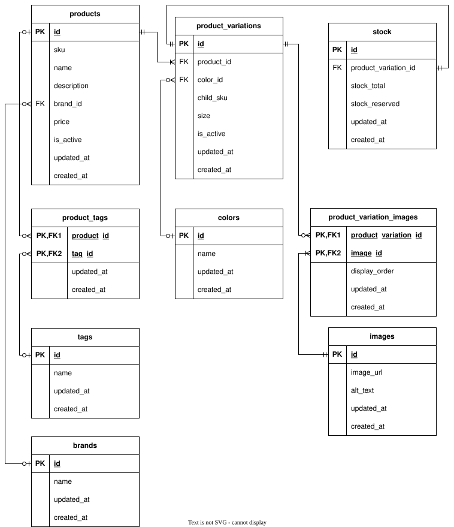

# Products API

> A Laravel-based asynchronous job processing hub powered by Amazon SQS for scalable product data management

[](https://laravel.com)
[](https://php.net)
[](https://aws.amazon.com/sqs/)
[](https://postgresql.org)

---

## 📋 Overview

**Products API** is a robust Laravel application designed to handle asynchronous product updates at scale. Built as a demonstration of modern web architecture, it showcases enterprise-level patterns for queue management, data processing, and API design.

The system receives product update jobs through Amazon SQS and processes them asynchronously, managing stock levels, pricing, descriptions, images, and tags with built-in deduplication and comprehensive logging.

### Key Features

- ✅ **Asynchronous Processing** - Handle high-volume updates without blocking
- ✅ **AWS SQS Integration** - Reliable, scalable message queuing
- ✅ **Job Deduplication** - Prevent duplicate processing with unique identifiers
- ✅ **Comprehensive Logging** - Full audit trail of all operations
- ✅ **RESTful API** - Clean, well-documented endpoints
- ✅ **Security First** - Protection against SQL injection, XSS, and CSRF
- ✅ **Production Ready** - Built with scalability and monitoring in mind

---

## 🏗️ Architecture

### Technology Stack

- **Backend**: Laravel 11.x with PHP 8.2+
- **Database**: PostgreSQL 14+
- **Queue**: Amazon SQS
- **Caching**: Redis (optional)
- **Testing**: PHPUnit

### Database Schema



**Core Entities:**
- **Products** - Main product data (SKU, name, price, description)
- **Brands** - Product brand information
- **Colors** - Available color options
- **Tags** - Categorization and labeling
- **Images** - Product imagery with alt text
- **ProductVariations** - Size/color variants with inventory tracking

---

## 🚀 Getting Started

### Prerequisites

- PHP 8.2 or higher
- Composer
- Node.js (for asset compilation)
- PostgreSQL 14+
- AWS Account (free tier supported)

### Installation

**1. Clone and Install Dependencies**

```bash
git clone <repository-url>
cd products-api
composer install
npm install
```

**2. Environment Configuration**

```bash
cp .env.example .env
php artisan key:generate
```

**3. Database Setup**

Using Docker (recommended):

```bash
docker run --name products-api-db \
  -e POSTGRES_DB=products \
  -e POSTGRES_USER=postgres \
  -e POSTGRES_PASSWORD=postgres \
  -p 5432:5432 \
  -d postgres
```

Update `.env` with database credentials:

```env
DB_CONNECTION=pgsql
DB_HOST=127.0.0.1
DB_PORT=5432
DB_DATABASE=products
DB_USERNAME=postgres
DB_PASSWORD=postgres
```

Run migrations:

```bash
php artisan migrate
```

**4. AWS SQS Configuration**

Create an SQS queue in AWS Console and configure:

```env
QUEUE_CONNECTION=sqs
AWS_ACCESS_KEY_ID=your-access-key
AWS_SECRET_ACCESS_KEY=your-secret-key
AWS_DEFAULT_REGION=us-east-1
SQS_PREFIX=https://sqs.us-east-1.amazonaws.com/123456789012
SQS_QUEUE=product-updates
```

**5. API Authentication**

Generate a secure token for API access:

```bash
php -r "echo bin2hex(random_bytes(32));"
```

Add to `.env`:

```env
API_TOKEN=your-generated-token-here
```

**6. Start Workers**

In separate terminal windows:

```bash
# Queue worker
php artisan queue:work sqs

# Scheduler
php artisan schedule:work

# Development server
php artisan serve
```

---

## 📡 API Documentation

### Authentication

All endpoints require Bearer token authentication:

```http
Authorization: Bearer {API_TOKEN}
```

### Quick Import

Import pre-configured collections for testing:

- 📂 **[Insomnia Collection](docs/api_rest_insomnia.yaml)**
- 📂 **[HAR File](docs/api_rest.har)** (Postman compatible)

### Endpoints Overview

#### 📦 Brands
```http
POST   /api/brands                    # Create brand
PATCH  /api/brands/update-name        # Update brand name
```

#### 🎨 Colors
```http
POST   /api/colors                    # Create color
PATCH  /api/colors/update-name        # Update color name
```

#### 🏷️ Tags
```http
POST   /api/tags                      # Create tag
PATCH  /api/tags/update-name          # Update tag name
```

#### 🖼️ Images
```http
POST   /api/images                    # Upload image
PATCH  /api/images/update-alt-text    # Update alt text
```

#### 🛍️ Products
```http
POST   /api/products                          # Create product
PATCH  /api/products/update-availability      # Toggle availability
PATCH  /api/products/update-brand             # Change brand
PATCH  /api/products/update-sku               # Update SKU
PATCH  /api/products/update-name              # Update name
PATCH  /api/products/update-description       # Update description
PATCH  /api/products/update-price             # Update price
PATCH  /api/products/attach-tag               # Add tag
PATCH  /api/products/detach-tag               # Remove tag
```

#### 📋 Product Variations
```http
POST   /api/product-variations                        # Create variation
PATCH  /api/product-variations/update-availability    # Toggle availability
PATCH  /api/product-variations/update-child-sku       # Update child SKU
PATCH  /api/product-variations/update-stock-total     # Update total stock
PATCH  /api/product-variations/update-stock-reserved  # Update reserved stock
PATCH  /api/product-variations/update-color           # Change color
PATCH  /api/product-variations/update-size            # Update size
PATCH  /api/product-variations/attach-image           # Add image
PATCH  /api/product-variations/detach-image           # Remove image
```

### Example Requests

**Standard Response**
```json
{
  "message": "job enqueued"
}
```
Status: `202 Accepted`

**Create Product**
```http
POST /api/products
Content-Type: application/json
Authorization: Bearer your-api-token

{
  "sku": "CAP-NE-001",
  "name": "Flat Brim Cap",
  "price": 99.90,
  "brand_id": 1,
  "description": "Comfortable and stylish flat brim cap",
  "is_active": true
}
```

**Update Product Price**
```http
PATCH /api/products/update-price
Content-Type: application/json
Authorization: Bearer your-api-token

{
  "id": 1,
  "price": 119.90
}
```

**Create Product Variation**
```http
POST /api/product-variations
Content-Type: application/json
Authorization: Bearer your-api-token

{
  "product_id": 1,
  "child_sku": "CAP-NE-001-S-BLUE",
  "color_id": 1,
  "size": "S",
  "stock_total": 100,
  "stock_reserved": 5,
  "is_active": true
}
```

---

## ⚙️ Job System

### Job Categories

**Creation Jobs**
- CreateProductJob
- CreateBrandJob
- CreateColorJob
- CreateTagJob
- CreateImageJob
- CreateProductVariationJob

**Product Update Jobs**
- UpdateProductAvailabilityJob
- UpdateProductBrandJob
- UpdateProductSkuJob
- UpdateProductNameJob
- UpdateProductDescriptionJob
- UpdateProductPriceJob

**Variation Update Jobs**
- UpdateProductVariationAvailabilityJob
- UpdateProductVariationChildSkuJob
- UpdateProductVariationStockTotalJob
- UpdateProductVariationStockReservedJob
- UpdateProductVariationColorJob
- UpdateProductVariationSizeJob

**Relationship Jobs**
- AttachProductTagJob / DetachProductTagJob
- AttachProductVariationImagesJob / DetachProductVariationImagesJob

**Entity Update Jobs**
- UpdateBrandJob
- UpdateColorJob
- UpdateTagJob
- UpdateImageAltTextJob

### Deduplication Strategy

All jobs implement `ShouldBeUnique` to prevent duplicate processing:

```php
class CreateProductJob implements ShouldQueue, ShouldBeUnique
{
    public function uniqueId()
    {
        return $this->payload->sku; // Unique identifier
    }
}
```

**Strategies by Type:**
- **Products**: SKU-based uniqueness
- **Updates**: ID + field combination
- **Relationships**: Combined related IDs

---

## 📊 Logging & Monitoring

### Comprehensive Event Tracking

The system logs all job lifecycle events:

```php
// Job queued
Log::info('job_queued', [
    'app' => env('APP_NAME'),
    'job' => $e->job::class,
    'queue' => $e->queue,
    'queued_at' => now()->toISOString(),
]);

// Job processing
Log::info('job_processing', [
    'job' => $e->job->resolveName(),
    'job_id' => $e->job->getJobId(),
    'attempts' => $e->job->attempts(),
]);

// Job completed
Log::info('job_processed', [
    'job' => $e->job->resolveName(),
    'job_id' => $e->job->getJobId(),
]);

// Job failed
Log::error('job_failed', [
    'job' => $e->job->resolveName(),
    'exception' => $e->exception->getMessage(),
]);
```

### Scheduled Task Monitoring

```php
// Task starting
Event::listen(ScheduledTaskStarting::class, function ($e) {
    Log::info('scheduled_task_starting', [
        'task' => $e->task->getSummaryForDisplay(),
        'command' => $e->task->command,
    ]);
});

// Task completed
Event::listen(ScheduledTaskFinished::class, function ($e) {
    Log::info('scheduled_task_finished', [
        'runtime' => $e->runtime . 'ms',
    ]);
});
```

### Log Structure

All logs are JSON-formatted and include:
- **Timestamp** - Precise event timing
- **Context** - Job/task information
- **Metadata** - IDs, attempts, execution time
- **Errors** - Full stack traces on failure

**Production Integration:**
- AWS CloudWatch
- ELK Stack (Elasticsearch, Logstash, Kibana)
- Sentry for error tracking

---

## 🧪 Testing

```bash
# Run all tests
php artisan test

# Run with coverage report
php artisan test --coverage

# Run specific test suite
php artisan test --filter=ProductJobTest
```

---

## 🔒 Security Features

- **Authentication** - Bearer token middleware on all routes
- **SQL Injection Protection** - Eloquent ORM with prepared statements
- **XSS Prevention** - Laravel's automatic sanitization
- **CSRF Protection** - Native Laravel CSRF tokens
- **Rate Limiting** - Configurable per-route throttling
- **Input Validation** - DTO-based data validation

---

## 📈 Scalability

### Performance Optimization

- **Multiple Workers** - Run parallel queue workers
  ```bash
  php artisan queue:work --queue=high,default --tries=3
  ```
- **Configurable Timeouts** - Handle long-running jobs
- **Automatic Retry** - Failed jobs retry with exponential backoff
- **Job Prioritization** - High-priority queue support

### Production Deployment

**Recommended Setup:**
- **Supervisor** - Persistent queue workers
- **Redis** - Session and cache management
- **Load Balancer** - Multiple application instances
- **Monitoring** - CloudWatch/Prometheus integration

---

## 🚀 Deployment Guide

### Production Checklist

```env
# Environment
APP_ENV=production
APP_DEBUG=false
APP_URL=https://your-domain.com

# Database
DB_CONNECTION=pgsql
DB_HOST=your-db-host
DB_DATABASE=products
DB_USERNAME=prod_user
DB_PASSWORD=secure_password

# Queue
QUEUE_CONNECTION=sqs
AWS_ACCESS_KEY_ID=production_key
AWS_SECRET_ACCESS_KEY=production_secret

# Cache
CACHE_DRIVER=redis
SESSION_DRIVER=redis
```

### Supervisor Configuration

```ini
[program:products-api-worker]
process_name=%(program_name)s_%(process_num)02d
command=php /var/www/html/artisan queue:work sqs --sleep=3 --tries=3
autostart=true
autorestart=true
numprocs=4
user=www-data
redirect_stderr=true
stdout_logfile=/var/www/html/storage/logs/worker.log
```

---

## 🎯 Technical Highlights

This project demonstrates expertise in:

- **Laravel Framework** - Advanced queue management and event handling
- **AWS Integration** - SQS for reliable message processing
- **Asynchronous Architecture** - Scalable job processing patterns
- **RESTful API Design** - Clean, maintainable endpoint structure
- **Database Design** - Normalized schema with proper relationships
- **Security Best Practices** - Industry-standard protection measures
- **Production Logging** - Comprehensive monitoring and debugging
- **Code Organization** - DTOs, Jobs, and Service Layer patterns

---

## 📝 License

This project is open-sourced software for portfolio demonstration purposes.

---

## 🤝 Contact

Feel free to reach out for questions or collaboration opportunities!

**Portfolio Project** - Showcasing modern Laravel development practices and AWS integration
